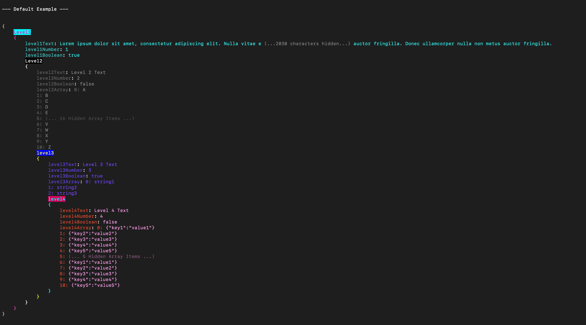
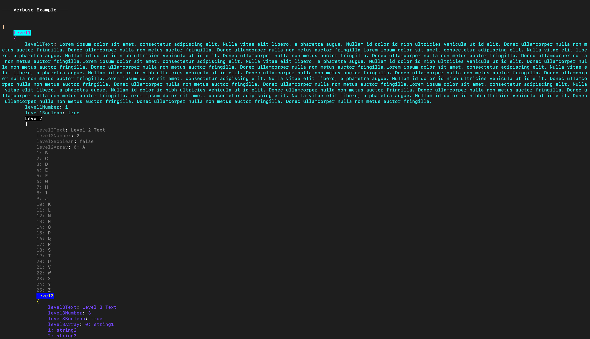
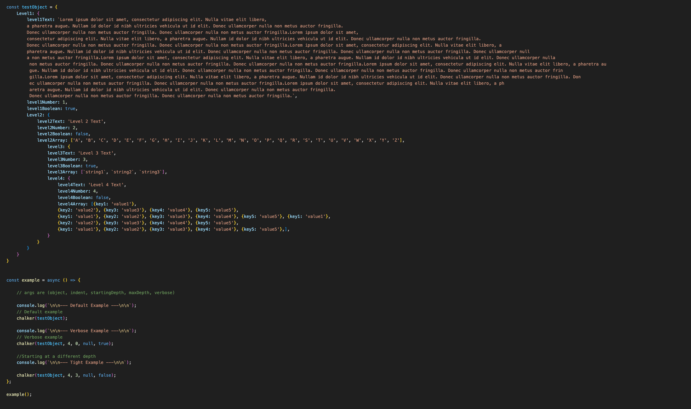

# Chalker 


## Rainbow Logger for Your JSON Objects
Recieves an an object as an argument and it will go through and chalk a new colour for each layer. Great for debugging and visualization. 

### Optional Args
```
indentNum \\ the indent number 
startingDepth \\ the starting level to display
maxDepth \\ the number of levels to print
verbose\\ True or False. If true it will print everything. If false (default) it was concatenate strings and arrays```

Example: 

```
 chalker(testObject, 4, 0, null, true);

```


### Example Output



Verbose:


which is the result of:




### Add More Colours

Colours are all formatted like this:

```
    {
        name: 'Almond',
        hex: '#EFDECD',
        complimentary: `#CD9575`,
        shades: {
            dim: {
                name: 'Almond (Dim)',
                hex: '#D9D0C1'
            },
            bright: {
                name: 'Almond (Bright)',
                hex: '#F4E0E6'
            },
        }
    },
```
