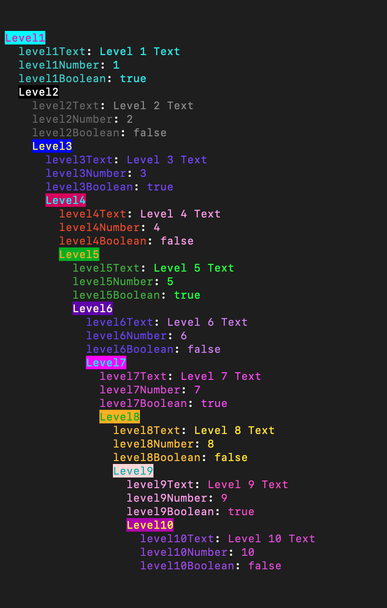

# Chalker 


## Rainbow Logger for Your JSON Objects
Recieves an an object as an argument and it will go through and chalk a new colour for each layer. Great for debugging and visualization. 


### Example Output



which is the result of:


### Add More Colours

Colours are all formatted like this:

```
    {
        name: 'Almond',
        hex: '#EFDECD',
        complimentary: `#CD9575`,
        shades: {
            dim: {
                name: 'Almond (Dim)',
                hex: '#D9D0C1'
            },
            bright: {
                name: 'Almond (Bright)',
                hex: '#F4E0E6'
            },
        }
    },
```
